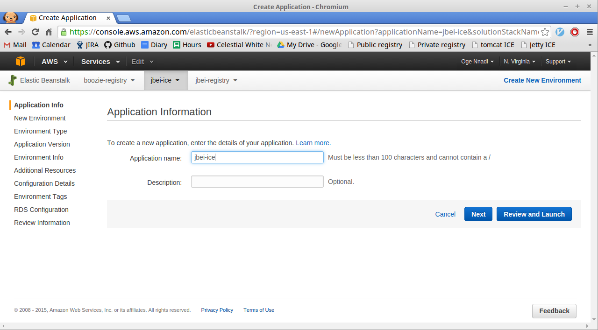
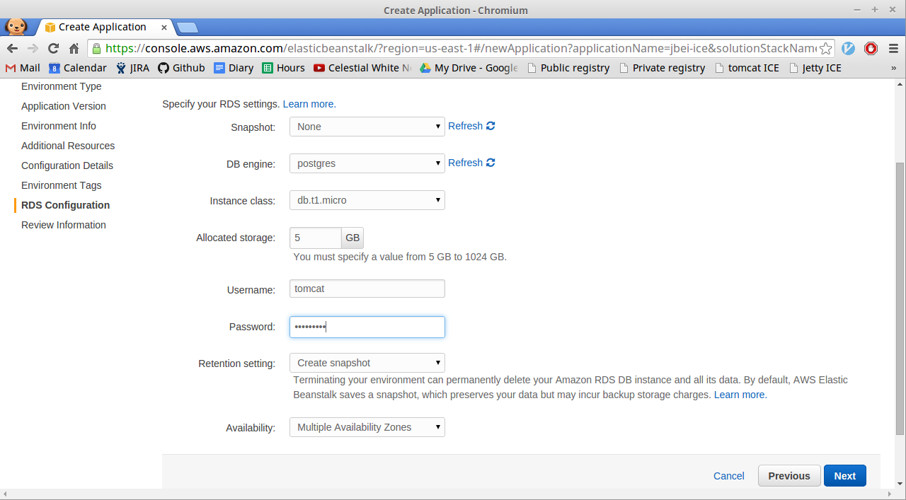
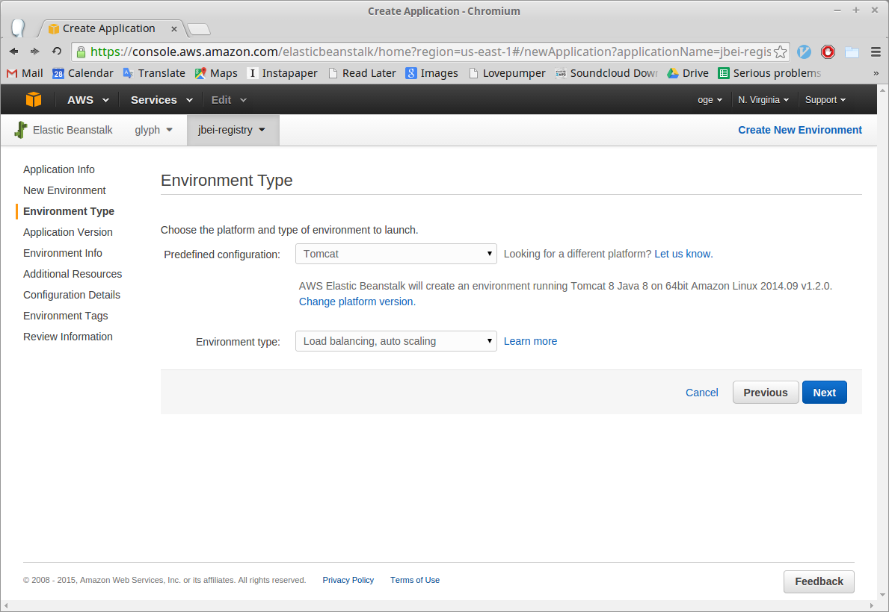
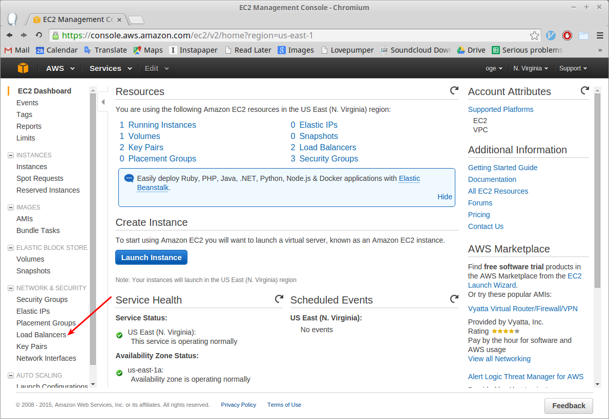
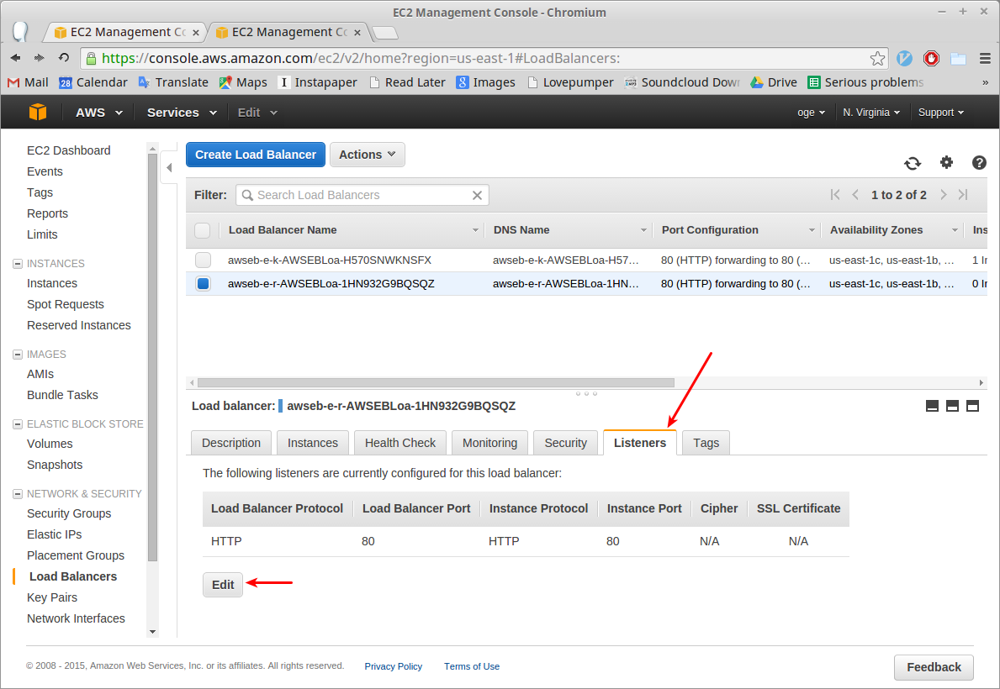
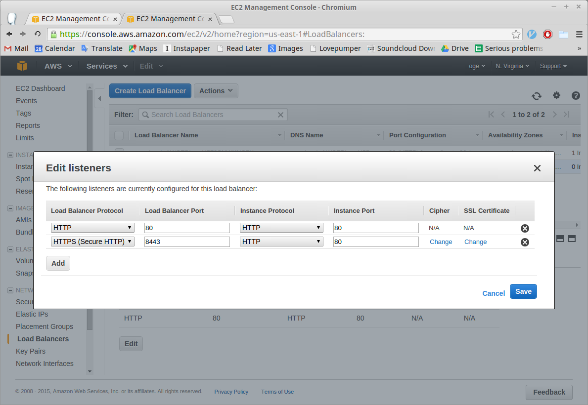
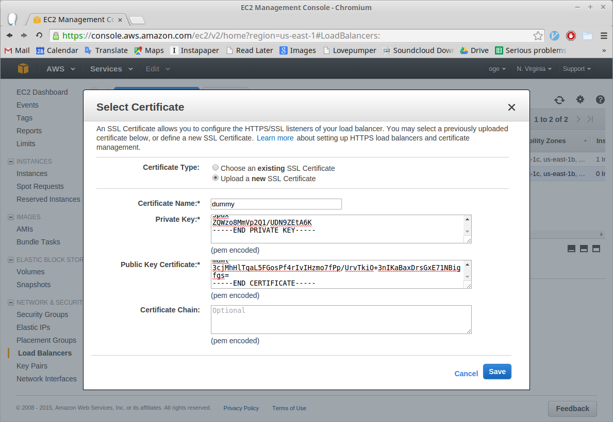
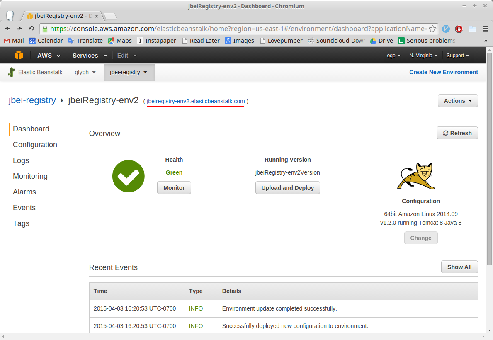
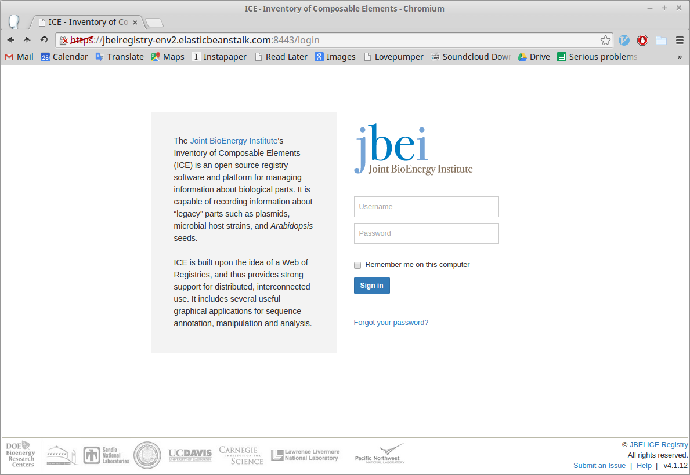

---
---

# Deploying ICE to AWS
The process takes about an hour to complete. You'll need

- An [Amazon Web Services (AWS) account](https://aws.amazon.com/)
- An [SSL certificate](https://www.namecheap.com/security/ssl-certificates/comodo.aspx)

We've included a dummy SSL certificate that you can use while testing out the intallation process. Note that using the dummy certificate will allow anyone in the world to view all your ICE repository data, in which case you might as well use the [public ICE registry](https://public-registry.jbei.org/login).

## Start the application

1. Start a new ICE application by clicking [this link](https://console.aws.amazon.com/elasticbeanstalk/?region=us-east-1#/newApplication?applicationName=jbei-ice&solutionStackName=Tomcat&sourceBundleUrl=https://s3.amazonaws.com/public-6612266/ice-4.1.13.war&environmentType=LoadBalancing&tierName=WebServer&instanceType=t1.micro&withVpc=false&withRds=true&rdsDBEngine=postgres&rdsDBAllocatedStorage=5&rdsDBInstanceClass=db.t1.micro&rdsMultiAZDatabase=true&rdsDBDeletionPolicy=Snapshot). This will create the application in Amazon's Eastern U.S. servers which are accessible worldwide. If you need your ICE instance to run in a particular geographic location, please let us know here [here](https://github.com/JBEI/ice/issues).

1. Enter a unique name for your application&mdash;something like "[institution-name]-ice"&mdash;and then click **Review and Launch**. 

1. On the **RDS Configuration** page, set **DB engine** to **postgres**. For the username, enter "tomcat", and then choose a secure password. Click **Next**.
    - Note that you may need the username and password to recover your registry's database in case of a catastrophic failure.

1. Click **Launch** on the **Review** page. It will take 30 minutes to an hour for the application to fully launch. When it is done, you'll see a green checkmark on the page. 

## Configure the application
Before you can use the application you need to upload your SSL certificate to AWS.

1. Go to the **EC2** site via the **Services** menu at the top of the page. 

1. Click **Load Balancers** in the left-hand menu. 

1. Select your load balancer from the table and then click the **Listeners** tab in the pane that appears at the bottom of the page and then click the **Edit** button. 

1. In the **Edit listeners** modal window click **Add**.
    1. In the new row that appears, under **Load Balancer Protocol**, ch oose **HTTPS (Secure HTTP)**. Change the **Load Balancer Port** to 8443. 
    1. Under **SSL Certificate** click **Change**. A **Select Certificate** modal window will pop up. For **Certificate Type** select **Upload a new SSL Certificate**.
        1. If you're using an SSL certificate that you bought, enter "server" for the certificate name. Otherwise enter "dummy". We'll assume that you're using a dummy certificate from here on out, but the instructions for setting up a real certificate are mostly the same.
        1. Paste your private key and public key certificate into the corresponding textboxes. Here is a [dummy private key](https://github.com/JBEI/ice/wiki/Dummy-SSL-private-key) and a [dummy public key certificate](https://github.com/JBEI/ice/wiki/Dummy-SSL-Public-Key-Certificate).
        1. If you have an optional certificate chain, enter it as well.
        1. Click **Save**. 
    1. Click **Save** again at the **Edit listeners** modal window, and when you see the success message, click **Close**. 

1. Now we need to tell the application to use the SSL certificate that we just uploaded. Go back to the **Elastic Beanstalk** site (Services > Elastic Beanstalk) and click on **Configuration** in the left-hand menu. 

1. Scroll down to the **Network Tier** section and click on the gear icon of the **Load Balancing** card. 

1. Change **Secure listener port** to 8443 and the **SSL Certificate ID** to the name of the certificate you uploaded. Click **Save**. 

1. Once Elastic Beanstalk is done updating the environment, we're ready to use the application.

1. Click the link next to the name of your application and environment. It will look like "jbeiregistry-env.elasticbeanstalk.com". 

1. Once you ignore the security warning (since you're using a dummy certificate), you should see the ICE login page. 

1. Enter the default username, "Administrator", and password, "Administrator". Change the password once you login since anyone on the Internet can now access your ICE registry.

1. And you're done. 

